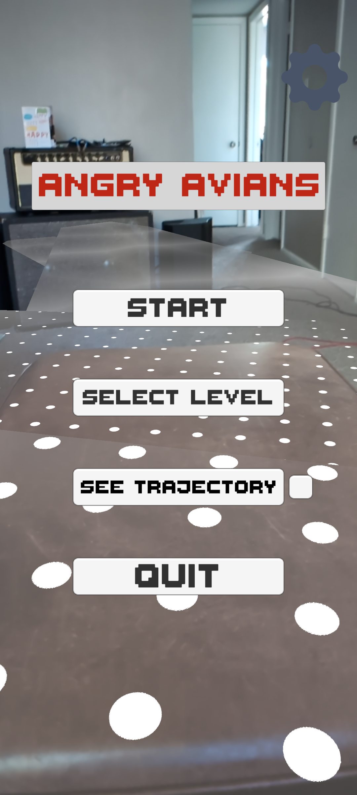
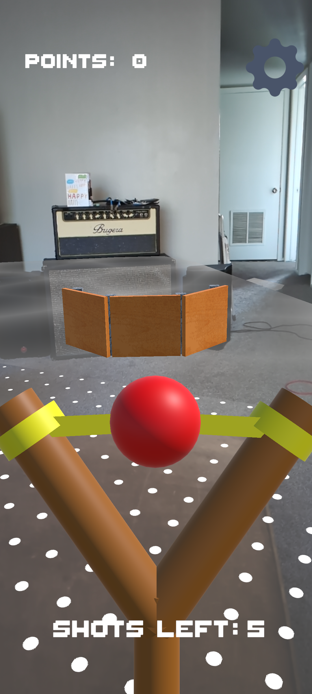
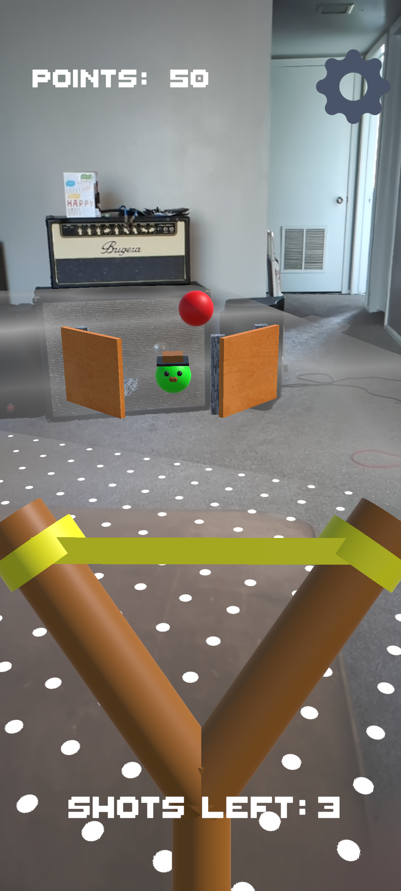
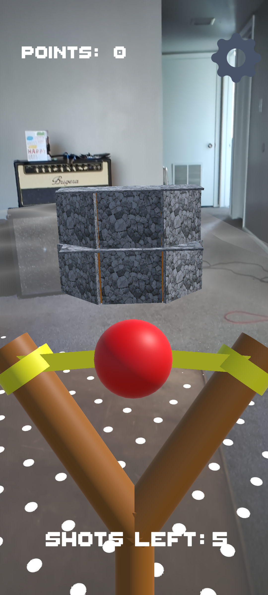
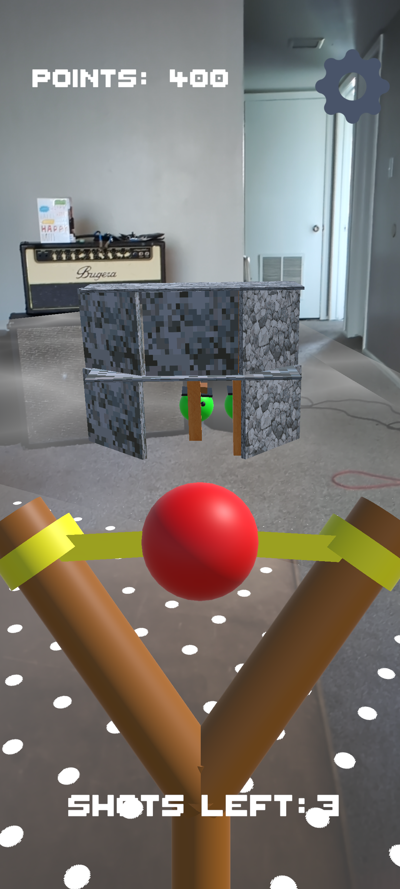
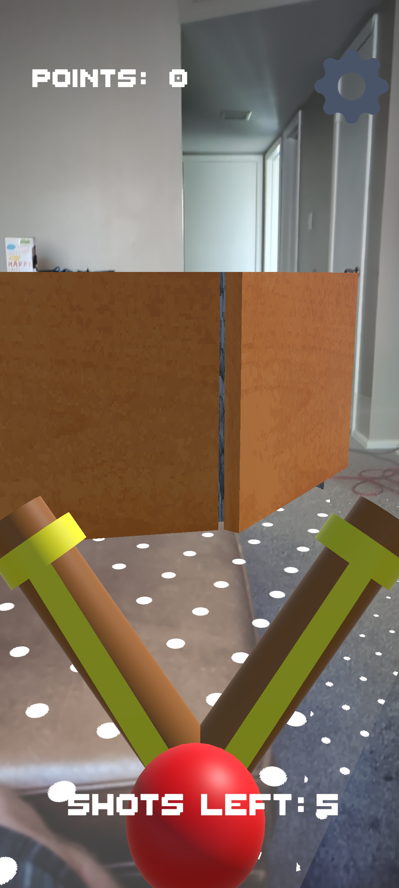
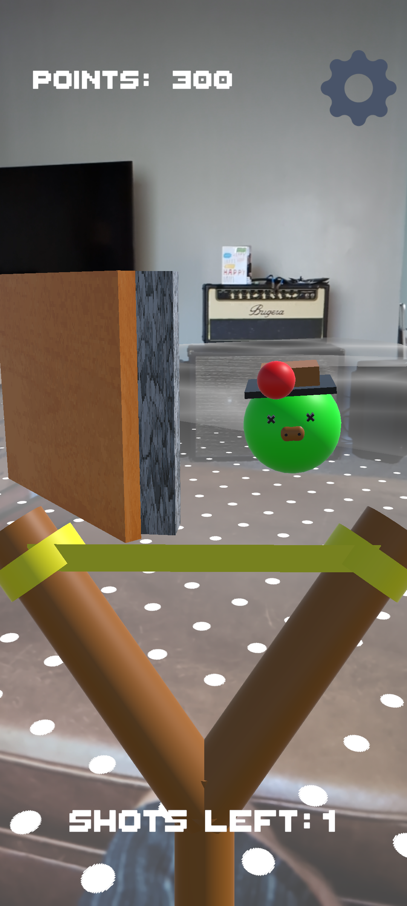

<<<<<<< HEAD
# 🎯 AR Slingshot Game

A mobile Augmented Reality game for Android and iOS built in Unity using AR Foundation and XR Interaction Toolkit. Players interact with a slingshot, firing projectiles at virtual targets for fun, skill-based gameplay.

## 📱 Features

- 📍 **AR Anchored Slingshot**: The slingshot appears fixed in front of the user’s camera.
- 🧠 **XR Interaction Toolkit**: Smooth, responsive touch controls adapted for mobile AR.
- 🏹 **Physics-based Projectiles**: Pull back and release to launch balls using real physics.
- 🎯 **Interactive Targets**: Place targets in AR space and test your aim.
- 🌍 **Cross-Platform Support**: Built for both Android (ARCore) and iOS (ARKit).
- 🎵 **Original Music**: Music written and recorded by myself in Reaper. 
- 🔊 **Fully Voiced NPCs**: All enemies are fully voiced with the finest in VO. 
- 🆙 **Two Extra Levels to Unlock**: Score enough points, and you can advance to harder levels. 
## 🧰 Built With

- [Unity 6](https://unity.com/releases/editor/qa/lts-releases)
- [AR Foundation](https://docs.unity3d.com/Packages/com.unity.xr.arfoundation)
- [XR Interaction Toolkit](https://docs.unity3d.com/Packages/com.unity.xr.interaction.toolkit)
- [ARKit (iOS)](https://developer.apple.com/augmented-reality/)
- [ARCore (Android)](https://developers.google.com/ar)

## 🚀 Getting Started

### Installationgit 

Download unity-ar_slingshot_game-Android.zip or unity-ar_slingshot_game-iOS.zip from the builds folder, and unzip. Install the app to your device. 

## 🕹️ How to Play

1. Launch the game on your mobile device.
2. Move your camera to detect a flat surface (e.g., floor or table).
3. Tap a valid surface to place the level. 
4. Pull back on the ball, and release to launch at targets. 
5. Get points for destroying objects and enemies. 

## 📸 Screenshots

## 📽️ Demo Video

## 📄 License

This project is open source. 
=======
Unity at atlas school
>>>>>>> e60454e721aec68ee5ee266bb6f85ba247ed3824
